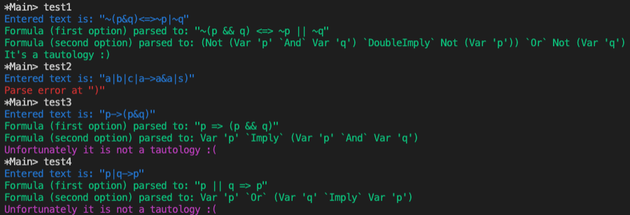
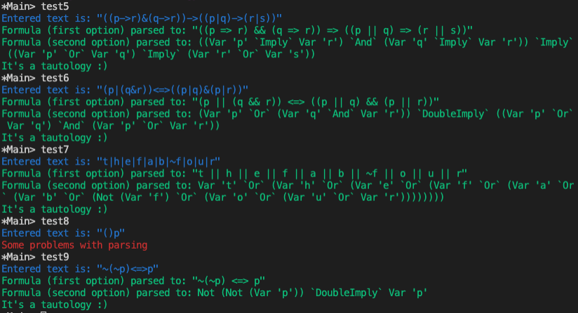
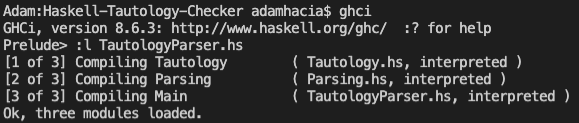
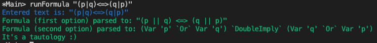
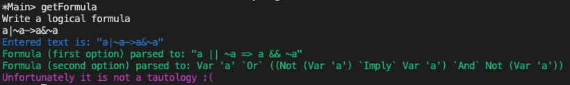

# Haskell Tautology Checker and Parser
> 

## Table of contents
- [Haskell Tautology Checker and Parser](#haskell-tautology-checker-and-parser)
  - [Table of contents](#table-of-contents)
  - [Tables of truth for operators](#tables-of-truth-for-operators)
        - [Negation](#negation)
        - [Disjunction](#disjunction)
        - [Conjunction](#conjunction)
        - [Implication](#implication)
        - [Biconditional](#biconditional)
  - [Screenshots](#screenshots)
  - [Technologies](#technologies)
  - [Setup](#setup)
  - [Features](#features)
  - [Status](#status)
  - [Inspiration](#inspiration)
  - [Contact](#contact)

## Tables of truth for operators

##### Negation
| P             | ~P            |
| ------------- |:-------------:|
| T             | F             |
| F             | T             |

##### Disjunction
| P             | Q             |P \| Q  |
| ------------- |:-------------:|:-------:|
| T             | T             | T      |
| T             | F             |   T    |
| F             | T             |    T   |
| F             | F             |    F   |

##### Conjunction
| P             | Q             |P & Q   |
| ------------- |:-------------:|:-------:|
| T             | T             | T      |
| T             | F             |   F    |
| F             | T             |    F   |
| F             | F             |    F   |

##### Implication
| P             | Q             |P ->   Q|
| ------------- |:-------------:|:------:|
| T             | T             | T      |
| T             | F             |   F    |
| F             | T             |    T   |
| F             | F             |    T   |

##### Biconditional
| P             | Q             |P <=> Q |
| ------------- |:-------------:|:------:|
| T             | T             |T       |
| T             | F             |F       |
| F             | T             |F       |
| F             | F             |T       |

## Screenshots

Tests examples





## Technologies
* Haskell

## Setup
1. Run ```ghci``` command
2. Run ```l TautologyParser.hs```


Then you can run ```runFormula``` eg.



or ```getFormula``` eg.



## Features
* Parsing logical formulas with
  - Disjunction as |
  - Conjunction as &
  - Implication as ->
  - Biconditional as <=>
  - Negation as ~
  - Brackets as ()


* Checking if it's a tautology

## Status
Project is: _in completed_

## Inspiration
1. [Video](https://www.youtube.com/watch?v=dDtZLm7HIJs) about parsers by Professor Graham Hutton
2. [Book](http://www.cs.nott.ac.uk/~pszgmh/pih.html) about programming in Haskell
## Contact
Created by [@HondaPL](https://hacia.students.wmi.amu.edu.pl/) 2021

